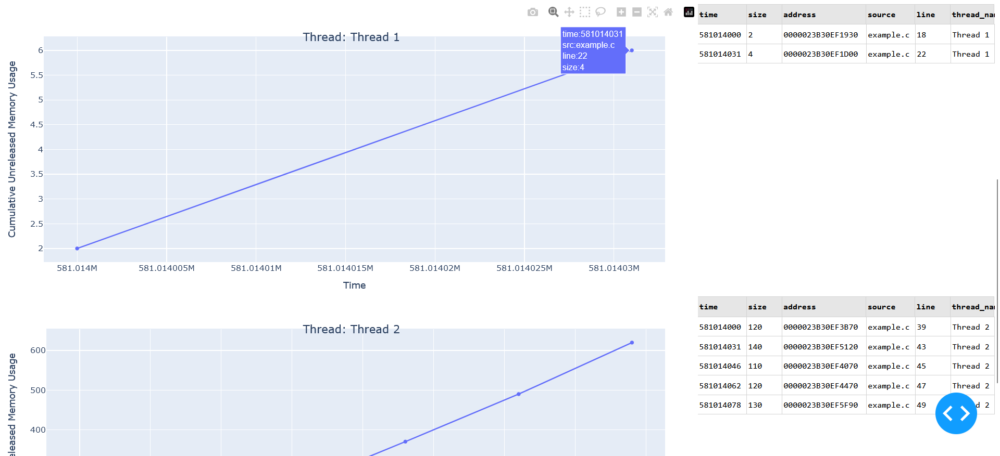

# MemoryLeak library
The MemoryLeak library helps identify memory leaks in embedded C programs by tracking allocated and unreleased memory using a linked list.

MemoryLeak is specifically designed for devices that may not have the capability to run more advanced memory management tools. For example, it can be effectively utilized with semihosting, offering a practical solution for memory leak detection on resource-constrained devices.

MemoryLeak is specifically designed for data collection purposes. To visualize and analyze the collected data, you can utilize the related project [HeapVisualizationEmbedded](https://github.com/tymciox/HeapVisualizationEmbedded).



## Contents
- [Overview](#overview)
- [Usage](#usage)
- [How to overwrite interface source file](#how-to-overwrite-interface-source-file)
- [How to run an example on a Windows](#how-to-run-an-example-on-a-windows)
- [How to build unit tests](#how-to-build-unit-tests)

## Overview
The MemoryLeak library enhances memory management by overriding the behavior of standard functions — `malloc`, `calloc`, and `free`. Allocated memory details are recorded within nodes of a linked list. Upon memory release, the associated node is removed from the linked list.

To facilitate memory leak detection, at the end of the program or during specific checkpoints, users can check for memory leaks. There are two ways to obtain information about allocated but unreleased memory: print to console and store in a file.

## Usage
1. Clone Git repository and include the `src/` directory in your project's compilation,
2. If you want to enable or disable, uncomment or comment the flag `#define MEMORY_LEAK_EMBEDDED` inside the source file `memory_leak.h`,
3. Inlcude the header file `#include "memory_leak.h"` in all of your source files,
4. Overwrite functions in `src/interface.c` with your own implementation,
5. While the program is running, you need to call a function: `memory_leak_print_result()` or `memory_leak_write_result_to_a_file()`,
6. If you used `memory_leak_print_result()` copy the result and save it to a .txt file,
7. [Display your result on a graph and table](https://github.com/tymciox/HeapVisualizationEmbedded)

## How to overwrite interface source file
- `print(char *string_info)` - Required only if you print the result, otherwise leave it empty

- `get_thread_name(char *destination_thread_name)` - Optional

- `get_time(unsigned int *destination_time)` - Required, SysTick is recommended

- `open_file(void)`, `close_file(void)`, `write_file(const char *single_info, const unsigned int len)` - Required only if you are writing to a file, otherwise leave it empty

## How to run an example on a Windows
1. Preconditions, you need:
- Windows 10/11 system,
- `make`, 
- GNU Compiler Collection (e.g. `MinGW`).

2. Launch powershell in the main directory:
```
PS C:\memory_leak> make
gcc -Wall -Wextra -g -o example -Isrc src/memory_leak.c src/interface.c example.c
PS C:\memory_leak> .\example.exe
Memory Leak Summary
************************
587875281,2,000001D9232EFCE0,example.c,17,Thread 1
587875281,4,000001D9232F1AD0,example.c,19,Thread 1
587875296,120,000001D9232EFBD0,example.c,36,Thread 2
587875296,20,000001D9232EDEB0,example.c,75,Thread 3
587875328,40,000001D9232EDB40,example.c,79,Thread 3
587875328,140,000001D9232F2300,example.c,40,Thread 2
587875343,110,000001D9232F2480,example.c,42,Thread 2
587875359,60,000001D9232F0660,example.c,83,Thread 3
587875359,120,000001D9232F2570,example.c,44,Thread 2
587875375,130,000001D9232F26D0,example.c,46,Thread 2
***********************
```
3. Copy the result and save it to a .txt file. 
4. [Display your result on a graph and table](https://github.com/tymciox/heap_visualization)

## How to build unit tests
1. Preconditions, you need:
- Windows 10/11 system,
- `cmake`, 
- GNU Compiler Collection (e.g. `MinGW`).

2. Launch powershell in the main directory:
```
PS C:\memory_leak> cmake -S . -B BuildTest -G 'MinGW Makefiles'
-- The C compiler identification is GNU 13.2.0
-- The CXX compiler identification is GNU 13.2.0
-- Detecting C compiler ABI info
-- Detecting C compiler ABI info - done
-- Check for working C compiler: C:/Program Files/mingw64/bin/gcc.exe - skipped
-- Detecting C compile features
-- Detecting C compile features - done
-- Detecting CXX compiler ABI info
-- Detecting CXX compiler ABI info - done
-- Check for working CXX compiler: C:/Program Files/mingw64/bin/c++.exe - skipped
-- Detecting CXX compile features
-- Detecting CXX compile features - done
-- Configuring done (2.9s)
-- Generating done (0.0s)
-- Build files have been written to: C:/Users/tymci/Desktop/memory_leak/BuildTest

PS C:\memory_leak> cd .\BuildTest\

PS C:\memory_leak\BuildTest> make
[ 11%] Building C object test/CMakeFiles/Unity.dir/cunity/unity.c.obj
[ 22%] Building C object test/CMakeFiles/Unity.dir/cunity/unity_fixture.c.obj
[ 33%] Linking C static library libUnity.a
[ 33%] Built target Unity
[ 44%] Building C object CMakeFiles/memory_leak.dir/src/memory_leak.c.obj
[ 55%] Building C object CMakeFiles/memory_leak.dir/src/interface.c.obj
[ 66%] Building C object CMakeFiles/memory_leak.dir/test/TestProductionCode_main.c.obj
[ 77%] Building C object CMakeFiles/memory_leak.dir/test/TestProductionCode_Runner.c.obj
[ 88%] Building C object CMakeFiles/memory_leak.dir/test/TestProductionCode.c.obj
[100%] Linking C executable memory_leak.exe
[100%] Built target memory_leak

PS C:\Users\tymci\Desktop\memory_leak\BuildTest> .\memory_leak.exe    
Unity test run 1 of 1
....

-----------------------
4 Tests 0 Failures 0 Ignored
OK
```
